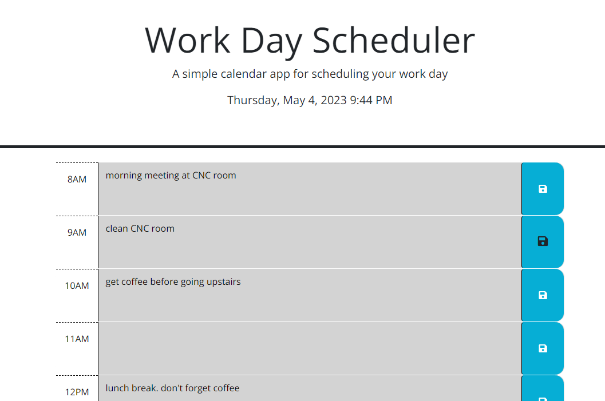

# WorkDayScheduler

## Description

This project was made to practice using 3rd party APIs such as jQuery and Dayjs. Through this project, I learned to read API documents and learned to use jquery to manipulate the DOM.

## Installation

NA

## Usage

To access, please visit the webpage url:
[]

## Credits

This webapp uses the following API libraries:
[jQuery](https://learn.jquery.com/)
[Dayjs](https://day.js.org/)

Base index.html and style.css was provided by UCI bootcamp.
[Gitlab UCI-Coding-Bootcamp](https://uci.bootcampcontent.com/UCI-Coding-Bootcamp/UCI-VIRT-FSF-PT-03-2023-U-LOLC/-/tree/main/05-Third-Party-APIs/02-Challenge)
